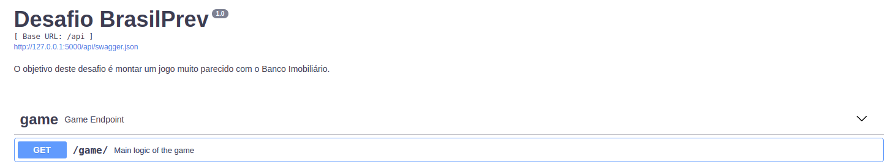

# BrasilPrev Python Developer Challenge



1. Run the server-side Flask app in one terminal window:

    ```sh
    $ cd server
    $ python3.7 -m venv env
    $ source env/bin/activate
    (env)$ pip install -r requirements.txt
    (env)$ python3 run.py
    ```

    Navigate to [http://localhost:5000/api/game](http://localhost:5000/api/game)
    
2. The API is self documented using Swagger.

    Navigate to [http://localhost:5000/api/docs](http://localhost:5000/api/docs)

3. To run the tests, go to **server folder** and open a terminal:

    ```sh
    $ pytest
    ```
